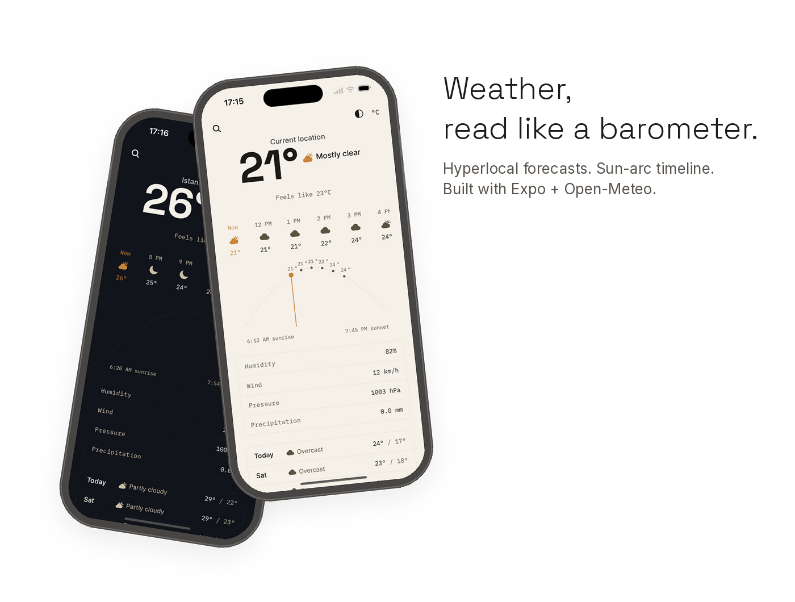
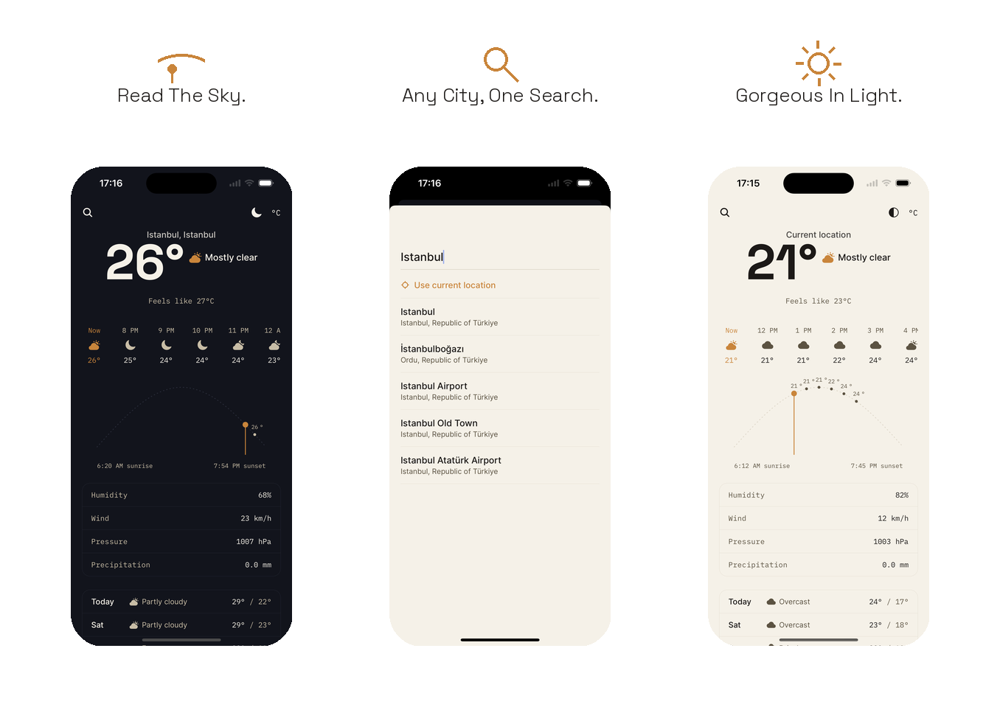

# Weather Now

Hyperlocal, distraction-free weather. Built with Expo + TypeScript.

A quiet paper-and-ink instrument rather than a glossy sky-gradient app.
The signature element is the **sun arc**: a horizontal timeline from sunrise
to sunset with hourly temperature ticks and an amber "needle" marking the
current time — read it like a barometer, not a cartoon icon.

## Preview





## Live demo

- **iOS Simulator build (EAS)**: grab the latest `.app` build from the
  [Expo dashboard](https://expo.dev/accounts/brian101/projects/weather-now/builds)
  and install it with `xcrun simctl install booted WeatherNow.app`, or drag
  it onto a running Simulator window.
- **Run it yourself** (fastest way to see it live): see [Setup](#setup)
  below — `npx expo start` and scan the QR with Expo Go on your phone.

> If you have an [Appetize.io](https://appetize.io) embed link for this
> build, drop it here and it'll render as a fully interactive demo on this
> page.

## Features

- **Hyperlocal current conditions** — GPS-based location via
  `expo-location`, with condition icon, temperature, and feels-like.
- **Sun arc** — sunrise-to-sunset timeline with hourly temperature ticks and
  a live "now" needle that tracks real elapsed time, not just the last fetch.
- **24-hour hourly strip** — scrollable hour-by-hour icons and temperatures,
  with the current hour called out in the accent color.
- **7-day forecast** — daily high/low, condition icon, and label in a
  bordered ledger list.
- **City search** — powered by Open-Meteo's geocoding API, with recent
  searches and a one-tap "Use current location" to snap back to GPS.
- **Units toggle** — °C/°F, applied consistently across every screen.
- **Day/night theme** — follows the weather's actual day/night state by
  default, or override manually (auto → light → dark) via the toggle next
  to the units switch.
- **Persistence** — units and recent searches survive an app restart
  (`zustand` + `AsyncStorage`).

## How to use

1. On first launch, grant location access to get hyperlocal weather for
   where you are — or decline and search for a city instead.
2. Tap the **search icon** (top left) to look up any city, revisit a recent
   search, or tap **Use current location** to switch back to GPS.
3. Tap **°C / °F** (top right) to toggle units everywhere.
4. Tap the **theme icon** next to it to cycle auto → light → dark.
5. Scroll the **hourly strip** to see the next 24 hours; the sun arc below
   it shows where "now" sits between sunrise and sunset.
6. Pull down to refresh; scroll past the data ledger for the 7-day outlook.

## Data & stack

- **Data**: [Open-Meteo](https://open-meteo.com) — free, no API key required,
  used for both geocoding (city search) and forecasts.
- **Location**: `expo-location`, GPS-based, with a graceful fallback to
  manual city search if permission is declined.
- **State**: `zustand` (with `persist` + `AsyncStorage`) for units, theme
  override, and recent searches.
- **Type**: Space Grotesk (display), Inter (body), IBM Plex Mono (data
  readouts), all via `@expo-google-fonts` — no font files to manage.

## Setup

```bash
npm install
npx expo start
```

Then scan the QR code with Expo Go (iOS/Android), or press `i` / `a` for a
simulator, or `w` for web.

No environment variables or API keys needed — Open-Meteo is used
unauthenticated.

## Project structure

```
app/
  _layout.tsx        Font loading + store hydration + navigation stack
  index.tsx           Home screen: dial, hourly strip, sun arc, ledger, forecast
  search.tsx           Modal: city search
src/
  components/          TempDial, HourlyStrip, SunArc, DataLedger,
                        DailyForecastList, SearchSheet
  hooks/                useLocation, useWeather
  lib/                   api.ts (Open-Meteo client), weatherCodes.ts
  store/                 useAppStore.ts (units, theme, recent searches — persisted)
  theme/                 tokens.ts (colors, type scale)
assets/                 App icon, adaptive icon, splash screen
```

## Next steps / ideas

- Swap the parabolic arc approximation in `SunArc.tsx` for the true solar
  elevation curve if you want astronomical accuracy.
- Add a night-mode illustration variant (the arc dips below the baseline
  after sunset instead of just fading).
- Per-day sunrise/sunset in the 7-day forecast for accurate day/night icons
  on future days (currently always shown as day-variant icons).
